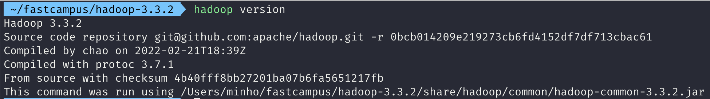

# HDFS 실습
## 1. HDFS CLI
- [HDFS 명령어 문서](https://hadoop.apache.org/docs/stable/hadoop-project-dist/hadoop-common/FileSystemShell.html)

### version
버전 확인

```bash
$ hadoop version
```



### mkdir
디렉토리 생성

```
hadoop fs -mkdir [-p] <paths>
```

```bash
$ hadoop fs -mkdir /user
$ hadoop fs -mkdir /user/fastcampus
$ hadoop fs -mkdir /user/fastcampus/input
```

### ls
디렉토리 파일 목록 확인

```bash
$ hadoop fs ls /
$ hadoop fs ls /user
$ hadoop fs ls -R /
```

### put, copyFromLocal
로컬 파일 시스템에 있는 데이터를 목적지 파일시스템으로 복사

```bash
$ hadoop fs -put /path/to/hadoop/LICENSE.txt /user/fastcampus/input
$ hadoop fs -copyFromLocal /path/to/hadoop/LICENSE.txt /user/fastcampus/input
```

### get, copyToLocal
HDFS에 있는 파일을 로컬 파일 시스템에 복사

```bash
$ hadoop fs -get /user/fastcampus/input/LICENSE.txt .
$ hadoop fs -copyToLocal /user/fastcampus/input/LICENSE.txt .
```

### cat
파일 내용 출력

```bash
$ hadoop fs -cat /user/fastcampus/input/LICENSE.txt
```

### mv
파일 옮기기

```bash
$ hadoop fs -mv /user/fastcampus/input/LICENSE.txt /user/fastcampus
```

### cp
파일 복사하기

```bash
$ hadoop fs -cp /user/fastcampus/LICENSE.txt /user/fastcampus/input/
```

### rm
파일 삭제하기

```bash
$ hadoop fs -rm /user/fastcampus/LICENSE.txt
```

### tail
파일의 끝부분을 보여주기

```bash
$ hadoop fs -tail /user/fastcampus/input/LICENSE.txt
```

### help
명령어 도움말

```bash
# hadoop fs -help [command]
$ hadoop fs -help cp
```

## 2. Java API
- [Java API 실습](01-hdfs/README.md)