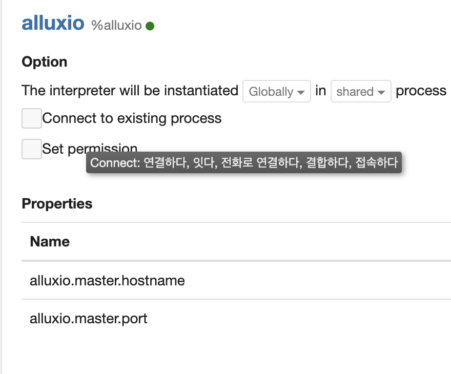
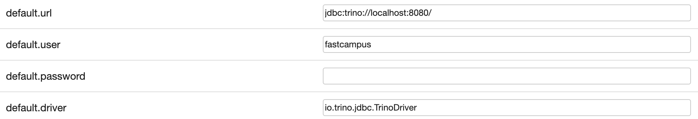

# Apache zeppelin

## 0. 사전 준비
- Java
- Python3
- Spark
  - Spark shell 실행 확인

## 1. 제플린 설치
### 1) 다운로드
```bash
# 다운로드
$ wget https://dlcdn.apache.org/zeppelin/zeppelin-0.10.1/zeppelin-0.10.1-bin-all.tgz
# 압축 풀기
$ tar zxvf zeppelin-0.10.1-bin-all.tgz
```

### 2) 제플린 설정
```bash
$ cp $ZEPPELIN_HOME/conf/zeppelin-env.sh.template $ZEPPELIN_HOME/conf/zeppelin-env.sh
```

zeppelin-env.sh 수정
```bash
# port 번호 변경
export ZEPPELIN_PORT=9090

# spark home 추가
export SPARK_HOME=${SPARK_HOME}

# pyspark 설정
export PYSPARK_PYTHON=python3
export PYSPARK_DRIVER_PYTHON=python3
```

### 3) 제플린 실행
```bash
$ bin/zeppelin.sh
```

### 4) 제플린 접속
http://localhost:8080

### 5) pyspark 튜토리얼 돌려보기
Spark Tutorial > 3. Spark SQL(PySpark)

### 6) spark scala 튜토리얼 돌려보기
Spark Tutorial > 3. Spark SQL(Scala)

## 2. 제플린을 이용한 데이터 시각화
### 1) Bar chart
pyspark
```python
df = spark.createDataFrame([
    ("United States",22.2,66301),
    ("China",15.4,10678),
    ("Japan",5.5,43758),
    ("Germany",4.1,49558),
    ("United Kingdom",2.9,42732),
    ("France",2.8,43852),
    ("Italy",2.1,34688),
    ("Brazil",2.0,9577),
    ("Canada",1.8,47735),
    ("South Korea",1.7,33983)
    ]).toDF("country", "gdp", "gdp_per_capita")
df.show()
df.createOrReplaceTempView("gdp_by_country")
```
spark.sql
```sql
select * from gdp_by_country
order by gdp_per_capita desc
```
bar chart를 클릭해서 결과 확인

### 2) Pie chart
`gdp` 테이블을 사용

spark.sql
```sql
select country, gdp from gdp_by_country
order by gdp desc
```
pie chart를 클릭하여 결과 확인

### 3) Line chart
pyspark
```python
df2 = spark.createDataFrame([
    ("2020", 8.31),
    ("2019", 3.67),
    ("2018", 3.90),
    ("2017", 4.36),
    ("2016", 4.87),
    ("2015", 5.28),
    ("2014", 6.17),
    ("2013", 7.38),
    ("2012", 8.07),
    ("2011", 8.95),
    ("2010", 9.63),
    ]).toDF("year", "unemployment_rate")
df2.show()
df2.createOrReplaceTempView("unemployment")
```

spark.sql
```sql
select * from unemployment
```
line chart 확인

### 4) Scatter chart
pyspark
```python
%pyspark
df3 = spark.createDataFrame([
        [10.0, 8.04],
        [8.07, 6.95],
        [13.0, 7.58],
        [9.05, 8.81],
        [11.0, 8.33],
        [14.0, 7.66],
        [13.4, 6.81],
        [10.0, 6.33],
        [14.0, 8.96],
        [12.5, 6.82],
        [9.15, 7.2],
        [11.5, 7.2],
        [3.03, 4.23],
        [12.2, 7.83],
        [2.02, 4.47],
        [1.05, 3.33],
        [4.05, 4.96],
        [6.03, 7.24],
        [12.0, 6.26],
        [12.0, 8.84],
        [7.08, 5.82],
        [5.02, 5.68]
    ])
df3.createOrReplaceTempView("scatter_example")
```

spark.sql
```sql
select * from scatter_example
```
Scatter chart 확인

## 3. Trino Interpreter
### 0) 제플린 실행하기
제플린 서버 포트 수정
conf/zeppelin-env.sh
```bash
ZEPPELIN_PORT=9090
```

제플린 실행
```bash
bin/zeppelin.sh
```

### 1) Trino 실행하기
```
$ docker run -p 8080:8080 --name trino trinodb/trino
```

### 2) Trino Interperter 생성
1) Interpreter 메뉴 클릭



2) Create 버튼 클릭

Properties 추가



trino jdbc driver dependency 추가

```xml
<dependency>
    <groupId>io.trino</groupId>
    <artifactId>trino-jdbc</artifactId>
    <version>386</version>
</dependency>
```


### 3) 제플린에서 Trino를 사용하여 데이터 분석하기
```sql
show catalogs;
show schemas in tpch;
use tpch.sf1;
show tables;
```

테이블 데이터 확인
```sql
use tpch.sf1;
select * from customer limit 10;
```

customer 카운트
```sql
select distinct count(custkey)
from tpch.sf1.customer 
```

nationkey 별 카운트 수 확인
```sql
select distinct nationkey, count(*)
from tpch.sf1.customer
group by nationkey
```

nation 테이블 조회
```sql
select * 
from tpch.sf1.nation
limit 100
```

nation 별 customer 카운트 수 확인
```sql
select nation.name, count(custKey)
from tpch.sf1.customer customer
join tpch.sf1.nation nation on customer.nationkey = nation.nationkey
group by nation.name
```